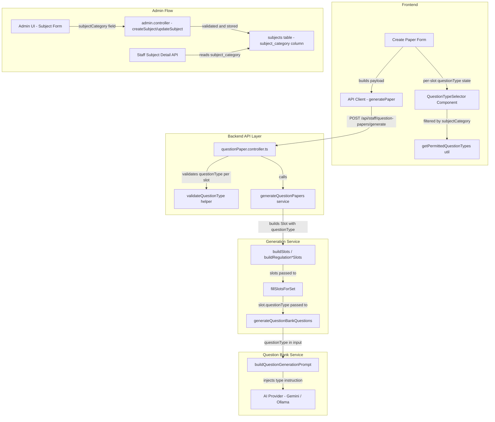

# Design Document: Global Question Type

## Overview

This document describes the technical design for the Global Question Type feature. The feature adds a per-question `questionType` field to the EduGen AI question paper generation workflow, allowing staff members to specify the cognitive style or format of each generated question (e.g., theory explanation, program writing, numerical calculation).

The design is additive by intent — it does not alter regulation-specific branching, section structure, Bloom level assignment, marks allocation, or any existing validation logic. Every new piece of data flows through the existing pipeline as an optional, nullable field alongside the existing unit, marks, difficulty, and Bloom fields.

### Key Design Decisions

**Union types over database enums**: `QuestionType` and `SubjectCategory` are defined as TypeScript union types (string literal unions) on both backend and frontend, backed by a plain-text nullable column in the database. This keeps migrations simple, avoids enum mutation overhead in PostgreSQL, and makes it trivial to add new values by updating only the constant arrays and mapping objects.

**Centralized type/category constants module**: All enum values, label maps, and category-to-types mappings live in a single `questionType.constants.ts` file on the backend (mirrored as `questionType.ts` in the frontend API library). This is the only file that changes when a new question type or subject category is added — all other code imports from it.

**Nullable passthrough with no conditional branching in orchestration**: The `questionType` field is added to the `Slot` interface and flows through `fillSlotsForSet` into `GenerateQuestionsInput` without any regulation-specific branching. The prompt injection happens entirely inside `buildQuestionGenerationPrompt`, which already receives all slot metadata.

**Subject category stored in subjects table**: The `subjectCategory` column is added to the existing `subjects` table as a nullable `VARCHAR(64)`. The staff subject detail API already reads from this table, so no new joins are needed to expose the field.

---

## Architecture



The data flow is strictly vertical: the `questionType` value set in the UI travels unchanged through the API request body → controller validation → service layer `Slot` → `GenerateQuestionsInput` → AI prompt. No component in the middle transforms or re-interprets the value.

---

## Components and Interfaces

### Backend: `src/types/questionType.constants.ts` (new file)

This is the single source of truth for all question type and subject category definitions on the backend.

```typescript
export const QUESTION_TYPES = [
  "theory",
  "problem_solving",
  "program_writing",
  "given_program_output",
  "given_program_explain",
  "debug",
  "algorithm",
  "numerical",
  "derivation",
  "trace",
] as const;

export type QuestionType = typeof QUESTION_TYPES[number];

export const QUESTION_TYPE_LABELS: Record<QuestionType, string> = {
  theory:               "Theory",
  problem_solving:      "Problem Solving",
  program_writing:      "Program Writing",
  given_program_output: "Given Program → Find Output",
  given_program_explain:"Given Program → Explain",
  debug:                "Debug / Find Error",
  algorithm:            "Algorithm",
  numerical:            "Numerical / Calculation",
  derivation:           "Derivation",
  trace:                "Trace / Dry Run",
};

export const QUESTION_TYPE_PROMPT_GUIDANCE: Record<QuestionType, string> = {
  theory:
    "Generate a conceptual explanation, definition, or discussion question that requires the student to recall or describe theoretical knowledge.",
  problem_solving:
    "Generate an applied problem that requires multi-step reasoning or computation to arrive at a solution.",
  program_writing:
    "Generate a question asking the student to write a complete, correct program or code snippet.",
  given_program_output:
    "Generate a question presenting a code snippet and asking the student to determine its exact output.",
  given_program_explain:
    "Generate a question presenting a code snippet and asking the student to explain what it does and how it works.",
  debug:
    "Generate a question presenting code that contains one or more errors, asking the student to identify and/or fix the error(s).",
  algorithm:
    "Generate a question asking the student to write or trace an algorithm or pseudocode for a given problem.",
  numerical:
    "Generate a question requiring numerical computation, formula application, or step-by-step arithmetic to reach a numeric result.",
  derivation:
    "Generate a question requiring the student to derive a formula, proof, or theoretical result step by step.",
  trace:
    "Generate a question requiring the student to trace execution or perform a dry run of a data structure operation.",
};

export const SUBJECT_CATEGORIES = [
  "programming",
  "data_structures",
  "mathematics",
  "general",
] as const;

export type SubjectCategory = typeof SUBJECT_CATEGORIES[number];

export const CATEGORY_QUESTION_TYPES: Record<SubjectCategory, QuestionType[]> = {
  programming: [
    "theory",
    "program_writing",
    "given_program_output",
    "given_program_explain",
    "debug",
    "problem_solving",
  ],
  data_structures: [
    "theory",
    "algorithm",
    "program_writing",
    "given_program_output",
    "given_program_explain",
    "trace",
    "problem_solving",
  ],
  mathematics: [
    "theory",
    "numerical",
    "problem_solving",
    "derivation",
  ],
  general: [...QUESTION_TYPES],
};

/**
 * Returns the permitted question types for a given subject category.
 * Falls back to all question types when:
 *   - category is null / undefined (no subject category set)
 *   - category value is not found in the mapping (future extensibility)
 */
export function getPermittedQuestionTypes(
  category: SubjectCategory | null | undefined
): QuestionType[] {
  if (!category) {
    return [...QUESTION_TYPES];
  }
  return CATEGORY_QUESTION_TYPES[category] ?? [...QUESTION_TYPES];
}

export function isValidQuestionType(value: unknown): value is QuestionType {
  return typeof value === "string" && (QUESTION_TYPES as readonly string[]).includes(value);
}

export function isValidSubjectCategory(value: unknown): value is SubjectCategory {
  return typeof value === "string" && (SUBJECT_CATEGORIES as readonly string[]).includes(value);
}
```

### Backend: `src/types/index.ts` (additions)

```typescript
// Add to existing SubjectRow interface
export interface SubjectRow {
  // ... existing fields ...
  subject_category: string | null; // stored as VARCHAR(64), validated against SubjectCategory union
}

// Add to existing SubjectWithRelationsRow — inherits subject_category from SubjectRow
```

The `SubjectResponse` type (in `subject.service.ts`) already maps `SubjectWithRelationsRow`, so `subjectCategory` will appear in API responses automatically once added to the row type and the SQL query.

### Backend: `src/services/questionBank.service.ts` (modifications)

**`GenerateQuestionsInput` interface** — add one field:

```typescript
export interface GenerateQuestionsInput {
  // ... existing fields ...

  /**
   * Optional question type constraint.
   * When non-null, the AI prompt is augmented with a type-specific instruction.
   * When null, existing behaviour is preserved with no type constraint.
   */
  questionType?: QuestionType | null;
}
```

**`buildQuestionGenerationPrompt` function** — add `questionType` parameter and inject instruction:

```typescript
function buildQuestionGenerationPrompt(
  topicLabel: string,
  contextBlock: string,
  marks: number,
  difficulty: QuestionDifficulty,
  bloomLevel: BloomLevel,
  questionCount: number,
  excludeTexts: string[],
  questionType?: QuestionType | null   // NEW PARAMETER
): string {
  // ... existing code to build difficultyLabel, bloomLabel, etc. ...

  // Build the question type instruction block (placed after Bloom requirements)
  const questionTypeInstruction = questionType
    ? `\nQUESTION TYPE CONSTRAINT:\n- Question type: ${QUESTION_TYPE_LABELS[questionType]}\n- ${QUESTION_TYPE_PROMPT_GUIDANCE[questionType]}\n`
    : "";

  return `
You are an experienced college faculty member preparing an official university-style examination question paper.

Generate exactly ${questionCount} candidate exam question(s).

ACADEMIC TOPIC / UNIT SCOPE:
${cleanTopicLabel}

QUESTION REQUIREMENTS:
- Each question must be worth exactly ${marks} mark(s).
- Difficulty level: ${difficultyLabel[difficulty]}.
- Bloom's Taxonomy level: ${bloomLabel[bloomLevel]}.
- REQUIRED ACTION VERBS for this Bloom level: ${bloomVerbGuidance(bloomLevel)}.
[... existing Bloom/marks requirements ...]
${questionTypeInstruction}
STRICT SOURCE PRIVACY RULES:
[... existing source privacy rules unchanged ...]

APPROVED ACADEMIC CONTEXT:
${contextBlock}

OUTPUT FORMAT:
[... existing format unchanged ...]
`.trim();
}
```

The injection point is: after the marks/Bloom/action-verb requirements block, before the `STRICT SOURCE PRIVACY RULES` section. This matches Requirement 6.5.

### Backend: `src/services/questionPaperGeneration.service.ts` (modifications)

**`Slot` interface** — add one optional field:

```typescript
interface Slot {
  sectionIndex: number;
  sectionName: string;
  marks: number;
  unitId: string | null;
  topicId: string | null;
  difficulty: QuestionDifficulty;
  bloomLevel: BloomLevel;
  courseOutcomeId: string | null;
  contextQueryText?: string | null;
  questionNumber: number | null;
  internalChoiceGroup: string | null;

  /** Optional question type constraint. null means no type constraint. */
  questionType?: QuestionType | null;   // NEW FIELD
}
```

**`fillSlotsForSet` function** — pass `slot.questionType` through to `generateQuestionBankQuestions`. No branching or filtering is added; the value is simply forwarded:

```typescript
// Inside the call to generateQuestionBankQuestions:
await generateQuestionBankQuestions(
  staffId,
  input.subjectId,
  {
    topicSource,
    marks: slot.marks,
    difficulty: slot.difficulty,
    bloomLevel: slot.bloomLevel,
    courseOutcomeId: slot.courseOutcomeId,
    questionCount: 1,
    sourceMode: effectiveSourceMode,
    questionType: slot.questionType ?? null,  // NEW: passthrough
  },
  usedTexts
);
```

**Slot building functions** (`buildSlots`, `buildRegulation2021InternalTest1Slots`, `buildRegulation2025Slots`, `buildRegulation2026Slots`, `buildRegulation2021Iat2Slots`) — the `Slot` interface change is additive with an optional field (`questionType?: QuestionType | null`). All existing slot construction code continues to work unchanged since the field is optional. Per-slot `questionType` values from the controller input are threaded through `GeneratePaperInput` to the slot population step.

**`GeneratePaperInput` interface** — add per-section question type arrays:

```typescript
export interface GeneratePaperInput {
  // ... existing fields ...

  /**
   * Per-slot question type constraints, keyed by a slot identifier.
   * The slot identifier is a string in the form:
   *   "section:{sectionIndex}:q:{questionNumber}" for main questions
   *   "section:{sectionIndex}:q:{questionNumber}:sub:{subIndex}" for sub-questions
   *
   * Absent keys are treated as null (no type constraint).
   * This is backward-compatible: callers that omit this field entirely
   * get the same behaviour as before.
   */
  questionTypeMap?: Record<string, QuestionType | null>;
}
```

Slot builders use `input.questionTypeMap?.[slotKey] ?? null` when constructing each `Slot`. The slot key scheme encodes section index and question number, which are already available at the point of slot construction.

### Backend: `src/controllers/questionPaper.controller.ts` (modifications)

**`validateGeneratePaperInput` function** — add parsing and validation for `questionTypeMap`:

```typescript
// Inside validateGeneratePaperInput, after existing field parsing:

let questionTypeMap: Record<string, QuestionType | null> | undefined;

if (input.questionTypeMap !== undefined && input.questionTypeMap !== null) {
  if (typeof input.questionTypeMap !== "object" || Array.isArray(input.questionTypeMap)) {
    return "questionTypeMap must be an object";
  }
  const rawMap = input.questionTypeMap as Record<string, unknown>;
  const validatedMap: Record<string, QuestionType | null> = {};
  for (const [slotKey, rawValue] of Object.entries(rawMap)) {
    if (rawValue === null) {
      validatedMap[slotKey] = null;
    } else if (!isValidQuestionType(rawValue)) {
      return `Invalid questionType "${rawValue}" for slot "${slotKey}". Must be one of: ${QUESTION_TYPES.join(", ")}`;
    } else {
      validatedMap[slotKey] = rawValue as QuestionType;
    }
  }
  questionTypeMap = validatedMap;
}

return {
  // ... existing fields ...
  questionTypeMap,
};
```

### Backend: `src/controllers/admin.controller.ts` (modifications)

**`validateSubjectInput` function** — add optional `subjectCategory` parsing:

```typescript
async function validateSubjectInput(body: unknown): Promise<
  | {
      subjectCode: string;
      subjectName: string;
      description?: string | null;
      departmentId: string;
      semesterId: string;
      credits: number;
      subjectCategory?: SubjectCategory | null;  // NEW
    }
  | string
> {
  const { subjectCode, subjectName, description, departmentId, semesterId, credits, subjectCategory } =
    (body ?? {}) as Record<string, unknown>;

  // ... existing validation unchanged ...

  let parsedSubjectCategory: SubjectCategory | null | undefined;
  if (subjectCategory !== undefined && subjectCategory !== null && subjectCategory !== "") {
    if (!isValidSubjectCategory(subjectCategory)) {
      return `Invalid subjectCategory "${subjectCategory}". Must be one of: ${SUBJECT_CATEGORIES.join(", ")}`;
    }
    parsedSubjectCategory = subjectCategory as SubjectCategory;
  } else {
    parsedSubjectCategory = null;
  }

  return {
    subjectCode,
    subjectName,
    description: typeof description === "string" ? description : null,
    departmentId,
    semesterId,
    credits,
    subjectCategory: parsedSubjectCategory,
  };
}
```

### Backend: `src/services/subject.service.ts` (modifications)

**`SubjectInput` interface** — add optional `subjectCategory`:

```typescript
export interface SubjectInput {
  subjectCode: string;
  subjectName: string;
  description?: string | null;
  departmentId: string;
  semesterId: string;
  credits: number;
  subjectCategory?: SubjectCategory | null;  // NEW
}
```

**`createSubject` and `updateSubject`** — include `subject_category` in the INSERT/UPDATE SQL.

**`getSubjectWithRelationsById` and `listSubjects`** — add `sub.subject_category` to the `JOIN_COLUMNS` constant so it appears in all responses.

**`listSubjectsForStaff`** — same `JOIN_COLUMNS` change automatically covers this.

### Frontend: `src/lib/questionType.ts` (new file, mirrored from backend constants)

```typescript
export const QUESTION_TYPES = [
  "theory",
  "problem_solving",
  "program_writing",
  "given_program_output",
  "given_program_explain",
  "debug",
  "algorithm",
  "numerical",
  "derivation",
  "trace",
] as const;

export type QuestionType = typeof QUESTION_TYPES[number];

export const QUESTION_TYPE_LABELS: Record<QuestionType, string> = {
  theory:               "Theory",
  problem_solving:      "Problem Solving",
  program_writing:      "Program Writing",
  given_program_output: "Given Program → Find Output",
  given_program_explain:"Given Program → Explain",
  debug:                "Debug / Find Error",
  algorithm:            "Algorithm",
  numerical:            "Numerical / Calculation",
  derivation:           "Derivation",
  trace:                "Trace / Dry Run",
};

export const SUBJECT_CATEGORIES = [
  "programming",
  "data_structures",
  "mathematics",
  "general",
] as const;

export type SubjectCategory = typeof SUBJECT_CATEGORIES[number];

export const CATEGORY_QUESTION_TYPES: Record<SubjectCategory, QuestionType[]> = {
  programming:    ["theory","program_writing","given_program_output","given_program_explain","debug","problem_solving"],
  data_structures:["theory","algorithm","program_writing","given_program_output","given_program_explain","trace","problem_solving"],
  mathematics:    ["theory","numerical","problem_solving","derivation"],
  general:        [...QUESTION_TYPES],
};

export function getPermittedQuestionTypes(
  category: SubjectCategory | null | undefined
): QuestionType[] {
  if (!category) return [...QUESTION_TYPES];
  return CATEGORY_QUESTION_TYPES[category] ?? [...QUESTION_TYPES];
}
```

### Frontend: `QuestionTypeSelector` component (new component)

```typescript
// src/components/QuestionTypeSelector.tsx

interface QuestionTypeSelectorProps {
  /** Current selected value; null = "No specific type" */
  value: QuestionType | null;
  /** Called when the user changes the selection */
  onChange: (value: QuestionType | null) => void;
  /** Subject category drives the filtered list. null = show all 10 types. */
  subjectCategory: SubjectCategory | null | undefined;
  /** Optional slot label for aria-label purposes e.g. "Q1" */
  slotLabel?: string;
  /** Whether the selector is disabled (e.g., during generation) */
  disabled?: boolean;
}

export function QuestionTypeSelector({
  value,
  onChange,
  subjectCategory,
  slotLabel,
  disabled,
}: QuestionTypeSelectorProps) {
  const permittedTypes = getPermittedQuestionTypes(subjectCategory);

  return (
    <select
      aria-label={slotLabel ? `Question type for ${slotLabel}` : "Question type"}
      value={value ?? ""}
      onChange={(e) => onChange(e.target.value === "" ? null : (e.target.value as QuestionType))}
      disabled={disabled}
    >
      <option value="">No specific type</option>
      {permittedTypes.map((type) => (
        <option key={type} value={type}>
          {QUESTION_TYPE_LABELS[type]}
        </option>
      ))}
    </select>
  );
}
```

This component is self-contained. It takes value/onChange (controlled component pattern) and a `subjectCategory` prop that controls filtering. The parent form holds the state.

### Frontend: Integration in Create Paper form

The Create Paper form state is extended with a `questionTypeMap: Record<string, QuestionType | null>` object alongside the existing per-slot state. The slot key scheme mirrors the backend: `"section:{sectionIndex}:q:{questionNumber}"` for main questions and `"section:{sectionIndex}:q:{questionNumber}:sub:{subIndex}"` for sub-questions.

The `subjectCategory` comes from the selected subject's API response (available after subject selection in step 1). It is stored in form state and passed down to each `QuestionTypeSelector` instance.

**Key behaviors:**
- The `questionTypeMap` state is initialized to `{}` and never cleared on step navigation — this satisfies Requirement 3.7.
- When the subject changes, the permitted type options update automatically (because `subjectCategory` prop changes), but already-selected values are **not** cleared. If a previously selected type is no longer in the permitted list for the new subject, it is retained in state but the selector will show it as an unknown option or reset to null on next interaction — this is an acceptable UX tradeoff documented in Error Handling below.
- Each `QuestionTypeSelector` renders in the same row container as the unit and marks fields for that slot (Requirement 3.2).

The `questionTypeMap` is serialized into the API request body as-is. Entries with null values are included explicitly to communicate "no type constraint" for that slot.

### Frontend: Admin Subject Form (modification)

The subject create/edit form gains a `subjectCategory` field rendered as a `<select>` with the four category options plus a blank/unset option. The field is optional; submitting without a value sends `subjectCategory: null` (treated as `general` by the backend logic in `getPermittedQuestionTypes`).

---

## Data Models

### Database Migration

```sql
-- Migration: add subject_category to subjects table
ALTER TABLE subjects
  ADD COLUMN subject_category VARCHAR(64) NULL;

-- No CHECK constraint is added here; validation is enforced at the application layer
-- to allow non-destructive future extensibility without further migrations.
-- An index is added for potential future filtering:
CREATE INDEX idx_subjects_subject_category ON subjects(subject_category);
```

The column is nullable. A `NULL` value means "no category set" which the frontend and service layer both treat as equivalent to `general` for question type filtering purposes (Requirement 8.3).

No migration is needed for the `question_papers` or `question_bank` tables because `questionType` is an ephemeral input constraint (it influences the AI prompt at generation time) and is not stored per generated question.

### Updated Type Definitions Summary

| Location | Change |
|---|---|
| `backend/src/types/index.ts` | Add `subject_category: string \| null` to `SubjectRow` |
| `backend/src/types/questionType.constants.ts` | New file: all type/category/mapping constants |
| `backend/src/services/questionPaperGeneration.service.ts` | Add `questionType?: QuestionType \| null` to `Slot`; add `questionTypeMap?` to `GeneratePaperInput` |
| `backend/src/services/questionBank.service.ts` | Add `questionType?: QuestionType \| null` to `GenerateQuestionsInput` |
| `backend/src/services/subject.service.ts` | Add `subjectCategory?: SubjectCategory \| null` to `SubjectInput`; update SQL |
| `frontend/src/lib/questionType.ts` | New file: mirrored constants + helpers |
| `frontend/src/components/QuestionTypeSelector.tsx` | New component |

---

## Correctness Properties

*A property is a characteristic or behavior that should hold true across all valid executions of a system — essentially, a formal statement about what the system should do. Properties serve as the bridge between human-readable specifications and machine-verifiable correctness guarantees.*

### Property 1: Label Map Completeness

*For any* `QuestionType` value in the `QUESTION_TYPES` array, `QUESTION_TYPE_LABELS[value]` shall return a non-empty string.

**Validates: Requirements 1.4**

---

### Property 2: Category Mapping Validity

*For any* `SubjectCategory` value in `SUBJECT_CATEGORIES`, `CATEGORY_QUESTION_TYPES[category]` shall return a non-empty array where every element is a valid `QuestionType` and no element appears more than once.

**Validates: Requirements 2.2**

---

### Property 3: Permitted Types Filtering

*For any* `SubjectCategory` value, `getPermittedQuestionTypes(category)` shall return a list containing exactly the values in `CATEGORY_QUESTION_TYPES[category]`; when called with `null`, `undefined`, or any unrecognised value, it shall return all ten `QuestionType` values.

**Validates: Requirements 2.3, 2.4, 2.4a**

---

### Property 4: Selector Count Invariant

*For any* question paper configuration with N main question slots and M sub-question slots (M ≥ 0), the rendered Create Paper form shall contain exactly N + M `QuestionTypeSelector` components.

**Validates: Requirements 3.1, 4.1**

---

### Property 5: Per-Slot Type State Isolation

*For any* two distinct slot identifiers `keyA` and `keyB` in `questionTypeMap`, setting `questionTypeMap[keyA]` to any `QuestionType` value or `null` shall not change the value stored at `questionTypeMap[keyB]`.

**Validates: Requirements 3.3, 4.2**

---

### Property 6: Category Change Propagates to All Selectors

*For any* subject category value and any number of question slots (main and sub-question), after the subject category changes to a new value, every rendered `QuestionTypeSelector` shall display only the question types permitted for the new category.

**Validates: Requirements 3.4, 4.3**

---

### Property 7: Null Option Universality

*For any* `QuestionTypeSelector` rendered with any `subjectCategory` value (including `null`), the selector shall include an empty/null option representing "No specific type".

**Validates: Requirements 3.5**

---

### Property 8: Step Navigation Preserves Selected Types

*For any* set of `(slotKey, questionType)` assignments stored in `questionTypeMap`, after navigating forward one or more form steps and then returning to the slot configuration step, every stored assignment shall remain unchanged.

**Validates: Requirements 3.7**

---

### Property 9: Payload Serialization Fidelity

*For any* `questionTypeMap` containing entries with `QuestionType` values or `null`, the API request payload built from the form state shall have `questionTypeMap[key]` equal to the corresponding form state value for every key — non-null types serialize to their string value, unset types serialize to `null`.

**Validates: Requirements 5.1, 5.2, 5.8**

---

### Property 10: QuestionType Validation (backend)

*For any* string value: if it is a member of `QUESTION_TYPES`, `isValidQuestionType(value)` shall return `true` and the controller shall accept it; if it is not a member of `QUESTION_TYPES`, `isValidQuestionType(value)` shall return `false` and the controller shall reject the request with a 400 status.

**Validates: Requirements 5.5, 5.6**

---

### Property 11: Prompt Injection Contains Type Guidance

*For any* non-null `QuestionType` value `qt`, `buildQuestionGenerationPrompt(...)` called with `questionType = qt` shall produce a prompt string that contains `QUESTION_TYPE_LABELS[qt]` and `QUESTION_TYPE_PROMPT_GUIDANCE[qt]`.

**Validates: Requirements 6.1, 6.2**

---

### Property 12: Prompt Additivity

*For any* `QuestionType` value `qt`, the prompt produced by `buildQuestionGenerationPrompt(...)` with `questionType = qt` shall contain all of the same structural sections as the prompt produced with `questionType = null` — specifically: the difficulty instruction, the Bloom level instruction, the marks depth guidance, and the source privacy rules.

**Validates: Requirements 6.4**

---

### Property 13: Prompt Section Ordering

*For any* non-null `QuestionType` value `qt`, in the prompt string produced by `buildQuestionGenerationPrompt(...)`, the index of the question type instruction block shall be strictly greater than the index of the Bloom level requirements and strictly less than the index of the source privacy rules.

**Validates: Requirements 6.5**

---

### Property 14: questionType Passthrough

*For any* slot with a non-null `questionType` value `qt`, after `fillSlotsForSet` invokes `generateQuestionBankQuestions` for that slot, the `GenerateQuestionsInput.questionType` argument shall equal `qt`.

**Validates: Requirements 7.4**

---

### Property 15: SubjectCategory Validation (backend)

*For any* string value: if it is a member of `SUBJECT_CATEGORIES`, `isValidSubjectCategory(value)` shall return `true` and the controller shall accept it in subject create/update; if it is not a member, `isValidSubjectCategory(value)` shall return `false` and the controller shall reject the request with a 400 status.

**Validates: Requirements 8.5, 8.6**

---

## Error Handling

### Invalid `questionType` in Generation Request

**Scenario**: Client sends a `questionTypeMap` entry with an unrecognized string value.

**Handling**: `validateGeneratePaperInput` in `questionPaper.controller.ts` iterates every entry in `questionTypeMap` and calls `isValidQuestionType`. On the first invalid value, it returns a descriptive 400 error: `"Invalid questionType \"<value>\" for slot \"<key>\". Must be one of: theory, problem_solving, ..."`. Generation does not proceed.

**Backward compatibility**: If `questionTypeMap` is absent from the request body, it is treated as `undefined` and skipped. All existing clients continue to work without change.

### Invalid `subjectCategory` in Subject Create/Update

**Scenario**: Admin submits a subject payload with an unrecognized `subjectCategory` value.

**Handling**: `validateSubjectInput` calls `isValidSubjectCategory`. On failure, it returns: `"Invalid subjectCategory \"<value>\". Must be one of: programming, data_structures, mathematics, general"`. A 400 is returned.

**Omitted field**: If `subjectCategory` is absent, `null`, or empty string, it is stored as `NULL` in the database without error. The frontend and `getPermittedQuestionTypes` treat `NULL` identically to `"general"`.

### Selected Type No Longer in Permitted List After Subject Change

**Scenario**: Staff selects `program_writing` for a slot, then changes the subject to one with `mathematics` category, which does not permit `program_writing`.

**Handling**: The selected value remains in `questionTypeMap` state. The `QuestionTypeSelector` renders the new permitted options without `program_writing`. If the staff does not re-select, the stale value (`program_writing`) is sent to the backend, where it passes `isValidQuestionType` (it is a valid type globally) and is forwarded to the AI prompt unchanged. The AI will receive an instruction to write a program-writing style question for a mathematics paper — this is an edge case the staff must manage consciously. 

An alternative design would be to clear the slot's `questionType` on subject change, but this violates Requirement 3.7 (do not reset on form navigation) in spirit. The design choice is to preserve all state and let the staff consciously review their selections after a subject change. A UI warning badge indicating "type not recommended for this subject" would be a future enhancement.

### AI Generation with Type Constraint Produces Unexpected Output

**Scenario**: The AI ignores or partially follows the question type instruction.

**Handling**: This is a soft failure — the AI prompt is advisory, not enforced. The generated question text is saved as-is. Staff can use the existing regenerate/replace functionality to retry. No additional error handling is needed in the service layer for this scenario.

### `questionTypeMap` Key Format Mismatch

**Scenario**: Frontend sends a key that does not match any slot in the paper (e.g., a stale key from a previous configuration).

**Handling**: Keys not used by any slot builder are silently ignored — the `input.questionTypeMap?.[slotKey]` lookup returns `undefined`, which coalesces to `null`. No error is raised. This provides robustness against UI state drift.

---

## Testing Strategy

### Unit Tests

Unit tests cover specific examples, edge cases, and validation logic.

**`questionType.constants.ts`**:
- Verify `QUESTION_TYPES` has exactly 10 elements
- Verify `QUESTION_TYPE_LABELS` has a non-empty string for every element of `QUESTION_TYPES`
- Verify `CATEGORY_QUESTION_TYPES["general"]` equals all 10 types
- Verify `getPermittedQuestionTypes(null)` returns all 10 types
- Verify `getPermittedQuestionTypes("mathematics")` returns exactly `["theory","numerical","problem_solving","derivation"]`
- Verify `getPermittedQuestionTypes("unknown_value" as any)` returns all 10 types (extensibility fallback)
- Verify `isValidQuestionType("theory")` returns `true`; `isValidQuestionType("invalid")` returns `false`
- Verify `isValidSubjectCategory("programming")` returns `true`; `isValidSubjectCategory("invalid")` returns `false`

**`buildQuestionGenerationPrompt`**:
- Verify prompt with `questionType = null` does not contain any "QUESTION TYPE CONSTRAINT" section
- Verify prompt with `questionType = "theory"` contains "Theory" and the theory guidance text
- Verify prompt with `questionType = "program_writing"` contains the program writing guidance
- Verify the Bloom level section appears before the question type instruction in the string
- Verify the source privacy section appears after the question type instruction

**`validateGeneratePaperInput`**:
- Valid `questionTypeMap` with known types → accepted
- `questionTypeMap` with unknown type string → 400 error message referencing the slot key
- Absent `questionTypeMap` → backward-compatible success
- `questionTypeMap: null` → treated as absent, success

**`validateSubjectInput`**:
- Valid `subjectCategory = "programming"` → accepted
- Invalid `subjectCategory = "foobar"` → 400 error
- Absent `subjectCategory` → accepted as null

### Property-Based Tests

Property tests are written using a PBT library (recommended: **fast-check** for TypeScript). Each test runs a minimum of 100 iterations.

**Feature: global-question-type, Property 1: Label map completeness**
```typescript
// For any QuestionType value, the label map returns a non-empty string
fc.assert(fc.property(
  fc.constantFrom(...QUESTION_TYPES),
  (qt) => typeof QUESTION_TYPE_LABELS[qt] === "string" && QUESTION_TYPE_LABELS[qt].length > 0
));
```

**Feature: global-question-type, Property 2: Category mapping validity**
```typescript
fc.assert(fc.property(
  fc.constantFrom(...SUBJECT_CATEGORIES),
  (cat) => {
    const types = CATEGORY_QUESTION_TYPES[cat];
    return types.length > 0 &&
      types.every(t => QUESTION_TYPES.includes(t as any)) &&
      new Set(types).size === types.length;
  }
));
```

**Feature: global-question-type, Property 3: Permitted types filtering**
```typescript
// For known categories, returns exactly the mapped list
fc.assert(fc.property(
  fc.constantFrom(...SUBJECT_CATEGORIES),
  (cat) => {
    const result = getPermittedQuestionTypes(cat);
    const expected = CATEGORY_QUESTION_TYPES[cat];
    return result.length === expected.length && result.every(t => expected.includes(t));
  }
));

// For null, returns all 10 types
fc.assert(fc.property(
  fc.constant(null),
  (cat) => getPermittedQuestionTypes(cat).length === QUESTION_TYPES.length
));
```

**Feature: global-question-type, Property 5: Per-slot state isolation**
```typescript
// Changing one slot's type doesn't affect another
fc.assert(fc.property(
  fc.uniqueArray(fc.string({ minLength: 1 }), { minLength: 2, maxLength: 2 }),
  fc.constantFrom(...QUESTION_TYPES),
  fc.constantFrom(...QUESTION_TYPES),
  ([keyA, keyB], typeA, typeB) => {
    const state: Record<string, QuestionType | null> = { [keyA]: typeB, [keyB]: typeB };
    state[keyA] = typeA; // mutate only keyA
    return state[keyB] === typeB;
  }
));
```

**Feature: global-question-type, Property 10: QuestionType validation**
```typescript
// Valid types are accepted
fc.assert(fc.property(
  fc.constantFrom(...QUESTION_TYPES),
  (qt) => isValidQuestionType(qt) === true
));

// Random strings not in QUESTION_TYPES are rejected
fc.assert(fc.property(
  fc.string().filter(s => !QUESTION_TYPES.includes(s as any)),
  (s) => isValidQuestionType(s) === false
));
```

**Feature: global-question-type, Property 11: Prompt injection contains type guidance**
```typescript
fc.assert(fc.property(
  fc.constantFrom(...QUESTION_TYPES),
  (qt) => {
    const prompt = buildQuestionGenerationPrompt(
      "test topic", "context", 5, "medium", "L2", 1, [], qt
    );
    return prompt.includes(QUESTION_TYPE_LABELS[qt]) &&
           prompt.includes(QUESTION_TYPE_PROMPT_GUIDANCE[qt]);
  }
));
```

**Feature: global-question-type, Property 12: Prompt additivity**
```typescript
fc.assert(fc.property(
  fc.constantFrom(...QUESTION_TYPES),
  (qt) => {
    const promptWithType = buildQuestionGenerationPrompt("topic", "ctx", 5, "medium", "L2", 1, [], qt);
    const promptWithout  = buildQuestionGenerationPrompt("topic", "ctx", 5, "medium", "L2", 1, [], null);
    const REQUIRED_SECTIONS = ["Difficulty level:", "Bloom's Taxonomy level:", "STRICT SOURCE PRIVACY RULES:"];
    return REQUIRED_SECTIONS.every(s => promptWithType.includes(s) && promptWithout.includes(s));
  }
));
```

**Feature: global-question-type, Property 13: Prompt section ordering**
```typescript
fc.assert(fc.property(
  fc.constantFrom(...QUESTION_TYPES),
  (qt) => {
    const prompt = buildQuestionGenerationPrompt("topic", "ctx", 5, "medium", "L2", 1, [], qt);
    const bloomIdx    = prompt.indexOf("Bloom's Taxonomy level:");
    const typeIdx     = prompt.indexOf("QUESTION TYPE CONSTRAINT:");
    const privacyIdx  = prompt.indexOf("STRICT SOURCE PRIVACY RULES:");
    return bloomIdx < typeIdx && typeIdx < privacyIdx;
  }
));
```

**Feature: global-question-type, Property 15: SubjectCategory validation**
```typescript
// Valid categories pass
fc.assert(fc.property(
  fc.constantFrom(...SUBJECT_CATEGORIES),
  (cat) => isValidSubjectCategory(cat) === true
));

// Invalid strings fail
fc.assert(fc.property(
  fc.string().filter(s => !SUBJECT_CATEGORIES.includes(s as any)),
  (s) => isValidSubjectCategory(s) === false
));
```

### Integration Tests

- `POST /api/staff/question-papers/generate` with a valid `questionTypeMap` → 202 accepted, paper generates
- `POST /api/staff/question-papers/generate` with an invalid type in `questionTypeMap` → 400 with descriptive message
- `POST /api/staff/question-papers/generate` without `questionTypeMap` (legacy client) → 202 accepted (backward compatibility)
- `POST /api/admin/subjects` with valid `subjectCategory` → 201, `subjectCategory` appears in response
- `POST /api/admin/subjects` with invalid `subjectCategory` → 400 with descriptive message
- `GET /api/staff/subjects/:id` → response includes `subjectCategory` field (null when not set)
- AI prompt generated for a slot with `questionType = "program_writing"` contains "Program Writing" guidance

### Frontend Component Tests

- `<QuestionTypeSelector subjectCategory="mathematics" />` renders exactly 4 options (+ the null option)
- `<QuestionTypeSelector subjectCategory={null} />` renders 11 options (10 types + null option)
- `<QuestionTypeSelector subjectCategory="programming" value="theory" onChange={fn} />` → calling onChange with a new value triggers the callback
- Changing `subjectCategory` prop from `"mathematics"` to `"programming"` updates the rendered options list
