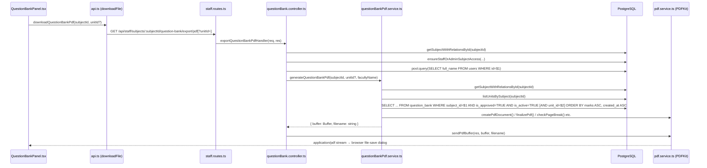

# Design Document: Question Bank PDF Export

## Overview

This feature adds a "Download PDF" capability to the existing Question Bank page. It is **entirely additive**: one new button, one new API function in the frontend client, one new route registration, one new controller handler, and one new PDF service. No existing file's exported interface, routing table, or database logic is modified.

The exported PDF is an academic "Question Bank" document formatted for official college use at Ramco Institute of Technology. It is unit-wise, with PART A (2-mark) / PART B (16-mark) / PART C (other marks) sub-sections, and uses the same PDFKit infrastructure (`createPdfDocument`, `finalizePdf`, `checkPageBreak`, `sendPdfBuffer`) already present in the codebase.

### Additive file set

| Action | File |
|--------|------|
| **Modify** | `frontend/components/staff/QuestionBankPanel.tsx` |
| **Modify** | `frontend/lib/api.ts` |
| **Modify** | `backend/src/routes/staff.routes.ts` |
| **Modify** | `backend/src/controllers/questionBank.controller.ts` |
| **Create** | `backend/src/services/questionBankPdf.service.ts` |

No other files are touched.

---

## Architecture



---

## Components and Interfaces

### Frontend — `QuestionBankPanel.tsx`

**New state:**
```typescript
const [isPdfLoading, setIsPdfLoading] = useState(false);
const [pdfError, setPdfError] = useState("");
```

**New handler:**
```typescript
async function handleDownloadPdf() {
  setPdfError("");
  setIsPdfLoading(true);
  try {
    const subjectCode = /* resolved from subject context or fallback */;
    await downloadQuestionBankPdf(
      subjectId,
      filterUnitId || undefined,
      `QuestionBank_${subjectCode}.pdf`
    );
  } catch (err) {
    setPdfError(err instanceof ApiError ? err.message : "Failed to download PDF");
  } finally {
    setIsPdfLoading(false);
  }
}
```

**Button placement** — added as the third child inside the existing `<div className="flex gap-2">` that already holds "Generate with AI" and "Add Manual Question":
```tsx
<button
  type="button"
  onClick={handleDownloadPdf}
  disabled={isPdfLoading}
  className="rounded-md border border-border px-4 py-2 text-sm font-medium text-foreground hover:bg-primary/5 disabled:opacity-60"
>
  {isPdfLoading ? "Downloading..." : "Download PDF"}
</button>
```

The `pdfError` is rendered inline below the control bar (or alongside the existing `error` state). No other props, state fields, or rendered elements change.

### Frontend API client — `api.ts`

**New function added after existing PDF download functions:**
```typescript
export async function downloadQuestionBankPdf(
  subjectId: string,
  unitId: string | undefined,
  filename: string
): Promise<void> {
  const path = `/staff/subjects/${subjectId}/question-bank/export/pdf${
    unitId ? `?unitId=${unitId}` : ""
  }`;
  return downloadFile(path, filename);
}
```

Reuses the existing `downloadFile` helper (fetch with credentials → blob → anchor click → revoke URL). No new network pattern is introduced.

### Backend route — `staff.routes.ts`

One line appended to the existing question-bank route block:
```typescript
import {
  // ... existing imports ...
  exportQuestionBankPdfHandler,
} from "../controllers/questionBank.controller";

// After the existing question-bank routes:
router.get(
  "/subjects/:subjectId/question-bank/export/pdf",
  exportQuestionBankPdfHandler
);
```

### Backend controller — `questionBank.controller.ts`

New exported function `exportQuestionBankPdfHandler`. All existing handlers are untouched.

```typescript
export async function exportQuestionBankPdfHandler(
  req: Request,
  res: Response,
  next: NextFunction
): Promise<void> {
  try {
    // 1. Validate subjectId
    const { subjectId } = req.params;
    if (!isUuid(subjectId)) {
      res.status(400).json({ success: false, message: "Invalid subject id" });
      return;
    }

    // 2. Subject existence check
    const subject = await getSubjectWithRelationsById(subjectId);
    if (!subject) {
      res.status(404).json({ success: false, message: "Subject not found" });
      return;
    }

    // 3. Access control
    await ensureStaffOrAdminSubjectAccess(req.user!.role, req.user!.id, subjectId);

    // 4. Optional unitId validation
    const { unitId } = req.query as Record<string, string | undefined>;
    if (unitId !== undefined) {
      if (!isUuid(unitId)) {
        res.status(400).json({ success: false, message: "Invalid unit id" });
        return;
      }
      // Verify unit belongs to this subject
      const units = await listUnitsBySubject(subjectId);
      const unitBelongs = units.some((u) => u.id === unitId);
      if (!unitBelongs) {
        res.status(400).json({ success: false, message: "Unit does not belong to this subject" });
        return;
      }
    }

    // 5. Fetch faculty name
    const facultyResult = await pool.query<{ full_name: string }>(
      "SELECT full_name FROM users WHERE id = $1 LIMIT 1",
      [req.user!.id]
    );
    const facultyName = facultyResult.rows[0]?.full_name?.trim() ?? "Not Specified";

    // 6. Generate PDF
    const { buffer, filename } = await generateQuestionBankPdf(
      subjectId,
      unitId,
      facultyName
    );

    // 7. Stream to client
    sendPdfBuffer(res, buffer, filename);
  } catch (error) {
    handleKnownError(error, res, next);
  }
}
```

**Validation order:** `isUuid(subjectId)` → 400 → `getSubjectWithRelationsById` → 404 → `ensureStaffOrAdminSubjectAccess` → 403 → `isUuid(unitId)` if present → 400 → unit-belongs-to-subject → 400 → faculty name query → `generateQuestionBankPdf` → `sendPdfBuffer`.

### Backend PDF service — `questionBankPdf.service.ts` (new file)

**Exported interface:**
```typescript
export interface QuestionBankPdfResult {
  buffer: Buffer;
  filename: string;
}

export async function generateQuestionBankPdf(
  subjectId: string,
  unitId: string | undefined,
  facultyName: string
): Promise<QuestionBankPdfResult>
```

---

## Data Models

### Question bank query row

```typescript
interface QBRow {
  id: string;
  unit_id: string | null;
  question_text: string;
  marks: number;
  bloom_level: string | null;
  created_at: string;
}
```

### Unit row (from `listUnitsBySubject`)

```typescript
interface UnitRow {
  id: string;
  subject_id: string;
  unit_number: number;
  unit_title: string;
}
```

### Subject with relations (from `getSubjectWithRelationsById`)

Fields used: `subject_code`, `subject_name`, `department_name`, `semester_number`, `academic_year_name`.

---

## Correctness Properties

*A property is a characteristic or behavior that should hold true across all valid executions of a system — essentially, a formal statement about what the system should do. Properties serve as the bridge between human-readable specifications and machine-verifiable correctness guarantees.*

### Property 1: Loading state disables button

*For any* `isPdfLoading` state equal to `true`, the "Download PDF" button SHALL be rendered with the `disabled` attribute set and display "Downloading..." text. Conversely, when `isPdfLoading` is `false`, the button SHALL be enabled and display "Download PDF".

**Validates: Requirements 1.3, 1.6**

### Property 2: Error recovery re-enables button

*For any* error thrown by `downloadQuestionBankPdf`, after the promise settles `isPdfLoading` SHALL be `false` and `pdfError` SHALL be a non-empty string, so the button returns to its usable state.

**Validates: Requirements 1.5**

### Property 3: UUID validation rejects all non-UUIDs

*For any* string that does not match the UUID v4 format, passing it as `subjectId` to the export endpoint SHALL yield HTTP 400 with `{ success: false, message: "Invalid subject id" }`. The same invariant holds for `unitId`: *for any* non-UUID string passed as the `unitId` query parameter, the endpoint SHALL return HTTP 400 with `{ success: false, message: "Invalid unit id" }`.

**Validates: Requirements 2.2, 2.5**

### Property 4: Only approved and active questions appear in the PDF

*For any* subject containing a mix of approved/unapproved and active/inactive questions, the questions passed to the PDF renderer SHALL satisfy `is_approved = TRUE AND is_active = TRUE` for every row — no unapproved or inactive question text shall appear in the output buffer.

**Validates: Requirements 3.1**

### Property 5: Unit filter excludes all other units

*For any* set of questions across multiple units, when the service is invoked with a specific `unitId`, the question rows fed to the PDF renderer SHALL contain only rows whose `unit_id` equals that `unitId` — no question from a different unit shall appear.

**Validates: Requirements 3.2**

### Property 6: Empty question bank always yields a valid PDF buffer

*For any* subject ID (and optional unit ID) for which zero approved+active questions exist, `generateQuestionBankPdf` SHALL return a `Buffer` of non-zero length rather than throwing or returning null. The buffer SHALL be a valid PDF containing the institutional header and the text "No questions found for the selected filter."

**Validates: Requirements 3.6**

### Property 7: Within-unit question ordering

*For any* unit containing questions with mixed marks values and mixed `created_at` timestamps, the order in which questions are rendered SHALL be: lower `marks` values first (ascending), and within the same marks value, earlier `created_at` first (ascending). Specifically, all `marks = 2` questions SHALL precede all `marks = 16` questions.

**Validates: Requirements 3.7, 5.4**

### Property 8: Header field fallback for missing subject data

*For any* subject record where one or more of `subject_code`, `subject_name`, `department_name`, `semester_number`, or `academic_year_name` is null or an empty string, the corresponding line in the PDF header SHALL contain the text "Not Specified" rather than an empty or blank field.

**Validates: Requirements 4.5**

### Property 9: toRoman correctness

*For any* integer `n` in the range 1–10, `toRoman(n)` SHALL return the correct uppercase Roman numeral string ("I", "II", …, "X"), and the result SHALL be non-empty and not equal to the decimal string representation of `n`.

**Validates: Requirements 4.3, 5.3**

### Property 10: sanitizeFilename output invariant

*For any* string input to `sanitizeFilename`, the returned string SHALL contain only characters matching `[a-zA-Z0-9\-_]`, SHALL be at most 80 characters long, and SHALL be non-empty (defaulting to "document" when the cleaned result would otherwise be empty).

**Validates: Requirements 8.2**

---

## Error Handling

| Condition | HTTP status | Body |
|-----------|-------------|------|
| `subjectId` is not a valid UUID | 400 | `{ success: false, message: "Invalid subject id" }` |
| Subject not found | 404 | `{ success: false, message: "Subject not found" }` |
| Staff does not have access to subject | 403 | (from `ensureStaffOrAdminSubjectAccess`) |
| `unitId` present but not a valid UUID | 400 | `{ success: false, message: "Invalid unit id" }` |
| `unitId` valid UUID but not in this subject | 400 | `{ success: false, message: "Unit does not belong to this subject" }` |
| PDF generation throws unexpectedly | 500 | via `handleKnownError` |

Frontend errors are surfaced via `pdfError` state, displayed inline near the button. The button is re-enabled after any error so the user can retry.

---

## PDF Service — Detailed Design

### Data flow

```
generateQuestionBankPdf(subjectId, unitId?, facultyName)
  │
  ├─ 1. getSubjectWithRelationsById(subjectId)
  │      → subject_code, subject_name, department_name,
  │        semester_number, academic_year_name
  │
  ├─ 2. listUnitsBySubject(subjectId)
  │      → UnitRow[] ORDER BY unit_number ASC
  │
  ├─ 3. pool.query(SELECT id, unit_id, question_text, marks, bloom_level,
  │               created_at FROM question_bank
  │               WHERE subject_id=$1 AND is_approved=TRUE AND is_active=TRUE
  │               [AND unit_id=$2]
  │               ORDER BY marks ASC, created_at ASC)
  │      → QBRow[]
  │
  ├─ 4. createPdfDocument()           ← from pdf.service.ts
  │
  ├─ 5. Render first-page header
  │
  ├─ 6. Register doc.on("pageAdded", ...) for running header
  │
  ├─ 7. Draw horizontal rule
  │
  ├─ 8. Iterate units (unit_number ASC):
  │      a. Filter questions for this unit
  │      b. If empty → skip unit
  │      c. checkPageBreak(doc, 80) → unit heading
  │      d. Group by marks: PART A (2), PART B (16), PART C (other, grouped by value)
  │      e. For each part: checkPageBreak(doc, 80) → part label
  │      f. For each question: checkPageBreak(doc, 60) → render question + bloom tag
  │
  ├─ 9. If total questions = 0 → render empty-state message
  │
  ├─ 10. finalizePdf(doc)
  │       → internally calls addPageNumbers (Page X of Y) THEN doc.end()
  │       → BUT we override footer BEFORE calling finalizePdf using
  │          bufferPages + switchToPage for custom footer
  │
  └─ 11. Return { buffer, filename }
```

### SQL query

```sql
SELECT id, unit_id, question_text, marks, bloom_level, created_at
FROM question_bank
WHERE subject_id = $1
  AND is_approved = TRUE
  AND is_active = TRUE
  [AND unit_id = $2]   -- only when unitId is provided
ORDER BY marks ASC, created_at ASC;
```

This is a **SELECT-only** query. No INSERT, UPDATE, or DELETE is issued anywhere in the service.

### PDF structure

```
[Page 1]
  ┌─────────────────────────────────────────────────────────┐
  │ RAMCO INSTITUTE OF TECHNOLOGY         (Times-Bold 16pt) │
  │ (Autonomous)                          (Times-Roman 12pt) │
  │ QUESTION BANK                         (Times-Bold 14pt) │
  │                                                         │
  │ Semester: III                         (Times-Roman 10pt) │
  │ Academic Year: 2024–2025              (Times-Roman 10pt) │
  │ Branch: Computer Science              (Times-Roman 10pt) │
  │ Faculty Name: Dr. A. Kumar            (Times-Roman 10pt) │
  │ Subject Code: CS3401                  (Times-Roman 10pt) │
  │ Subject Name: Operating Systems       (Times-Roman 10pt) │
  │ ─────────────────────────────────────────────────────── │
  │                                                         │
  │ UNIT I – INTRODUCTION TO OS           (Times-Bold 12pt) │
  │                                                         │
  │ PART A – 2 MARK QUESTIONS             (Times-Bold 11pt) │
  │ 1. What is an operating system?       (Times-Roman 10.5pt│
  │    (Bloom Level: L1)                  (Times-Roman 9pt) │
  │ 2. Define a process.                                    │
  │    (Bloom Level: L2)                                    │
  │                                                         │
  │ PART B – 16 MARK QUESTIONS            (Times-Bold 11pt) │
  │ 1. Explain the types of OS in detail. (Times-Roman 10.5pt│
  │    (Bloom Level: L4)                                    │
  │                                                         │
  │ UNIT II – PROCESS MANAGEMENT          (Times-Bold 12pt) │
  │ ...                                                     │
  └─────────────────────────────────────────────────────────┘

[Page 2+]  top 8pt running header (Times-Roman):
  "RAMCO INSTITUTE OF TECHNOLOGY (Autonomous) | Question Bank – CS3401 Operating Systems"

[Every page] footer at y = page.height − 28 (Times-Roman 8pt):
  "Page 1 of 5  |  Generated by: Dr. A. Kumar  |  Generated Date: 15-07-2025"
```

### Header rendering

```typescript
// Times-Bold 16pt, centered
doc.font("Times-Bold").fontSize(16).text("RAMCO INSTITUTE OF TECHNOLOGY", { align: "center" });
// Times-Roman 12pt, centered
doc.font("Times-Roman").fontSize(12).text("(Autonomous)", { align: "center" });
// Times-Bold 14pt, centered
doc.font("Times-Bold").fontSize(14).text("QUESTION BANK", { align: "center" });
doc.moveDown(0.5);
// Subject info lines — Times-Roman 10pt, centered
doc.font("Times-Roman").fontSize(10);
doc.text(`Semester: ${semesterLabel}`, { align: "center" });
doc.text(`Academic Year: ${academicYear}`, { align: "center" });
doc.text(`Branch: ${branch}`, { align: "center" });
doc.text(`Faculty Name: ${facultyName}`, { align: "center" });
doc.text(`Subject Code: ${subjectCode}`, { align: "center" });
doc.text(`Subject Name: ${subjectName}`, { align: "center" });
// Horizontal rule
doc.moveDown(0.5);
doc.moveTo(doc.page.margins.left, doc.y)
   .lineTo(doc.page.width - doc.page.margins.right, doc.y)
   .stroke();
doc.moveDown(0.6);
```

Fallback for all fields: if the value is null, undefined, or blank → `"Not Specified"`.

Semester is converted via `toRoman(n)` (copied from `questionPaperPdf.service.ts`). If `semester_number` is null → `"Not Specified"`.

### Running header (pages 2+)

```typescript
doc.on("pageAdded", () => {
  const left = doc.page.margins.left;
  const w = doc.page.width - doc.page.margins.left - doc.page.margins.right;
  doc.font("Times-Roman").fontSize(8).fillColor("#666666")
     .text(
       `RAMCO INSTITUTE OF TECHNOLOGY (Autonomous) | Question Bank – ${subjectCode} ${subjectName}`,
       left, doc.page.margins.top - 20,
       { width: w, align: "left", lineBreak: false }
     )
     .fillColor("black");
  doc.y = doc.page.margins.top + 5;
});
```

### Footer (every page)

The footer is written **after all content**, using `bufferPages + switchToPage`, consistent with `addPageNumbers` in `pdf.service.ts`. The service extends that pattern to include faculty name and generated date:

```typescript
function addQuestionBankFooter(doc: PDFKit.PDFDocument, facultyName: string): void {
  const range = doc.bufferedPageRange();
  const today = new Date();
  const dd = String(today.getDate()).padStart(2, "0");
  const mm = String(today.getMonth() + 1).padStart(2, "0");
  const yyyy = today.getFullYear();
  const dateStr = `${dd}-${mm}-${yyyy}`;

  for (let i = range.start; i < range.start + range.count; i++) {
    doc.switchToPage(i);
    const originalBottom = doc.page.margins.bottom;
    doc.page.margins.bottom = 0;
    const footerY = doc.page.height - 28;
    const w = doc.page.width - doc.page.margins.left - doc.page.margins.right;

    doc.font("Times-Roman").fontSize(8).fillColor("#444444")
       .text(
         `Page ${i + 1} of ${range.count}  |  Generated by: ${facultyName}  |  Generated Date: ${dateStr}`,
         doc.page.margins.left, footerY,
         { width: w, align: "center", lineBreak: false }
       )
       .fillColor("black");
    doc.page.margins.bottom = originalBottom;
  }
}
```

`addQuestionBankFooter` is called **inside the `finalizePdf` callback**, before `doc.end()`. Since `pdf.service.ts`'s `finalizePdf` calls `addPageNumbers` (Page X of Y) internally, the custom footer **replaces** the generic page-number footer. This is achieved by calling a local `finalizePdf`-equivalent that calls `addQuestionBankFooter` instead of `addPageNumbers`.

Alternatively (and more precisely per the codebase pattern), the service calls `finalizePdf` from `pdf.service.ts` but overrides the footer by iterating pages **before** `doc.end()` via a wrapper:

```typescript
async function finalizeWithCustomFooter(
  doc: PDFKit.PDFDocument,
  facultyName: string
): Promise<Buffer> {
  return new Promise((resolve, reject) => {
    const chunks: Buffer[] = [];
    doc.on("data", (chunk: Buffer) => chunks.push(chunk));
    doc.on("end", () => resolve(Buffer.concat(chunks)));
    doc.on("error", reject);
    addQuestionBankFooter(doc, facultyName); // writes footer on all pages
    doc.end();
  });
}
```

This mirrors `finalizePdf` exactly, substituting the footer function.

### Unit section rendering

```typescript
for (const unit of units) {
  const unitQuestions = questions.filter((q) => q.unit_id === unit.id);
  if (unitQuestions.length === 0) continue;

  // Unit heading
  checkPageBreak(doc, 80);
  doc.font("Times-Bold").fontSize(12)
     .text(`UNIT ${toRoman(unit.unit_number)} – ${unit.unit_title.toUpperCase()}`,
           { width: contentWidth });
  doc.moveDown(14 / 12); // ~14pt gap

  // Group by marks
  const partA = unitQuestions.filter((q) => q.marks === 2);
  const partB = unitQuestions.filter((q) => q.marks === 16);
  const otherMarks = [...new Set(
    unitQuestions.filter((q) => q.marks !== 2 && q.marks !== 16).map((q) => q.marks)
  )].sort((a, b) => a - b);

  if (partA.length > 0) renderPart(doc, "PART A – 2 MARK QUESTIONS", partA, contentWidth);
  if (partB.length > 0) renderPart(doc, "PART B – 16 MARK QUESTIONS", partB, contentWidth);
  for (const m of otherMarks) {
    const partC = unitQuestions.filter((q) => q.marks === m);
    renderPart(doc, `PART C – ${m} MARK QUESTIONS`, partC, contentWidth);
  }
}
```

### Question rendering

```typescript
function renderQuestion(
  doc: PDFKit.PDFDocument,
  num: number,
  question: QBRow,
  contentWidth: number
): void {
  checkPageBreak(doc, 60);
  doc.font("Times-Roman").fontSize(10.5).fillColor("black")
     .text(`${num}. ${question.question_text}`,
           { width: contentWidth, lineBreak: true });
  const bloomLabel = question.bloom_level ?? "N/A";
  doc.font("Times-Roman").fontSize(9).fillColor("#444444")
     .text(`(Bloom Level: ${bloomLabel})`,
           { width: contentWidth, lineBreak: false });
  doc.fillColor("black").moveDown(6 / 9); // 6pt gap after bloom tag
}
```

### Empty state

```typescript
if (questions.length === 0) {
  doc.font("Times-Roman").fontSize(10)
     .text("No questions found for the selected filter.", { align: "center" });
}
```

### toRoman helper

Copied verbatim from `questionPaperPdf.service.ts` (not re-exported from that file — copied into `questionBankPdf.service.ts` as a module-private function):

```typescript
function toRoman(value: number): string {
  const map: Record<number, string> = {
    1: "I", 2: "II", 3: "III", 4: "IV", 5: "V",
    6: "VI", 7: "VII", 8: "VIII", 9: "IX", 10: "X",
  };
  return map[value] ?? String(value);
}
```

---

## Data Relationships

```
academic_years
    └─── semesters (academic_year_id) ─── academic_year_name
              └─── subjects (semester_id) ─── semester_number
                        └─── departments (department_id) ─── department_name
                        │
                        └─── units (subject_id) ─── unit_number, unit_title
                                  └─── question_bank (unit_id, subject_id)
                                            ─── is_approved, is_active, marks,
                                                bloom_level, question_text, created_at
```

`getSubjectWithRelationsById` traverses the `subjects → departments → semesters → academic_years` chain and returns all fields needed for the header in one call. `listUnitsBySubject` returns all units for the subject ordered by `unit_number ASC`.

---

## Filename Construction

```
"QuestionBank_" + subjectCode + "_" + sanitizeFilename(subjectName)
```

- `subjectCode` is used as-is (alphanumeric by convention). If blank → `"Unknown"`.
- `sanitizeFilename(subjectName)` applies the existing helper: normalize NFKD → strip non-`[a-zA-Z0-9-_ ]` → trim → replace spaces with `_` → truncate to 80 chars → default `"document"` if empty.
- `sendPdfBuffer` appends `.pdf` automatically, so the caller passes the filename without extension.

Example: subject code `CS3401`, name `"Operating Systems"` → filename `QuestionBank_CS3401_Operating_Systems.pdf`.

---

## Page Header / Footer Strategy (bufferPages + switchToPage)

PDFKit's `bufferPages: true` mode (set by `createPdfDocument`) holds all pages in memory until `doc.end()` is called. This allows iterating over all pages after content is fully written. The pattern is:

1. Write all content (headers, units, questions).
2. **Before** calling `doc.end()`, iterate `doc.bufferedPageRange()`.
3. For each page `i`, call `doc.switchToPage(i)`.
4. Temporarily set `doc.page.margins.bottom = 0` to suppress auto page-break.
5. Draw footer text at fixed `y = doc.page.height − 28`.
6. Restore `doc.page.margins.bottom`.
7. After all pages processed, call `doc.end()`.

The running header for pages 2+ is drawn via the `doc.on("pageAdded", ...)` event, which fires synchronously each time `doc.addPage()` is called during content rendering. The first page does **not** receive the running header (the full institutional header is on page 1 instead).

This is the same strategy used by `addPageNumbers` in `pdf.service.ts` and `drawDocumentControlFooter` in `questionPaperPdf.service.ts`.

---

## Testing Strategy

### Unit tests (example-based)

- **Button rendering**: QuestionBankPanel renders a "Download PDF" button alongside the existing action buttons.
- **API function URL construction**: `downloadQuestionBankPdf` with `unitId` produces path with `?unitId=`, without `unitId` produces path without query string.
- **Controller — 404 path**: mock `getSubjectWithRelationsById` returning null → assert 404.
- **Controller — 403 path**: mock `ensureStaffOrAdminSubjectAccess` throwing → assert 403.
- **Controller — unit not in subject**: mock `listUnitsBySubject` returning units that don't include the provided UUID → assert 400.
- **PDF service — header fallback**: subject record with all null fields → PDF buffer contains "Not Specified".
- **PDF service — empty questions**: zero-row result → buffer is non-null Buffer, contains "No questions found".
- **Filename construction**: subject code `"CS3401"`, name `"Operating Systems"` → filename contains `"QuestionBank_CS3401_Operating_Systems"`.

### Property-based tests

Property-based tests use a PBT library (e.g., `fast-check` for TypeScript). Each test runs a minimum of 100 iterations.

**Property 1** — `isPdfLoading` disables button
*Tag: Feature: question-bank-pdf-export, Property 1: Loading state disables button*
Generate: boolean `isPdfLoading`. Assert: when true → button `disabled`; when false → button enabled.

**Property 2** — Error recovery re-enables button
*Tag: Feature: question-bank-pdf-export, Property 2: Error recovery re-enables button*
Generate: arbitrary Error objects. Simulate `downloadQuestionBankPdf` throwing. Assert: after settling, `isPdfLoading = false` and `pdfError` is non-empty.

**Property 3** — UUID validation rejects non-UUIDs
*Tag: Feature: question-bank-pdf-export, Property 3: UUID validation rejects all non-UUIDs*
Generate: arbitrary strings that are not UUID v4. Call `isUuid(value)`. Assert: always returns false (meaning 400 would be returned).

**Property 4** — Only approved+active questions in PDF
*Tag: Feature: question-bank-pdf-export, Property 4: Only approved and active questions appear in PDF*
Generate: arbitrary sets of question rows with mixed `is_approved`/`is_active` flags. Apply the SQL filter logic. Assert: all remaining rows have `is_approved = true AND is_active = true`.

**Property 5** — Unit filter excludes other units
*Tag: Feature: question-bank-pdf-export, Property 5: Unit filter excludes all other units*
Generate: arbitrary sets of questions with random `unit_id` values and a target `unitId`. Apply filter. Assert: all rows have `unit_id = unitId`.

**Property 6** — Empty question bank yields valid buffer
*Tag: Feature: question-bank-pdf-export, Property 6: Empty question bank always yields a valid PDF buffer*
Generate: arbitrary `subjectId`/`unitId` combinations that map to 0 questions. Call `generateQuestionBankPdf`. Assert: result is a `Buffer` with `length > 0`.

**Property 7** — Within-unit ordering
*Tag: Feature: question-bank-pdf-export, Property 7: Within-unit question ordering*
Generate: arbitrary lists of `QBRow` with varying `marks` and `created_at`. Apply the ORDER BY logic. Assert: for any two consecutive questions in the result, `q[i].marks <= q[i+1].marks`, and when `q[i].marks === q[i+1].marks`, `q[i].created_at <= q[i+1].created_at`.

**Property 8** — Header fallback for missing data
*Tag: Feature: question-bank-pdf-export, Property 8: Header field fallback for missing subject data*
Generate: subject records with random null/blank/non-null combinations for each field. Call the header rendering logic. Assert: the resulting PDF text buffer does not contain empty field values — each null/blank field maps to "Not Specified".

**Property 9** — toRoman correctness
*Tag: Feature: question-bank-pdf-export, Property 9: toRoman correctness*
Generate: integers in range [1, 10]. Assert: `toRoman(n)` returns a non-empty string that is a valid Roman numeral and is not the decimal representation of `n`.

**Property 10** — sanitizeFilename invariant
*Tag: Feature: question-bank-pdf-export, Property 10: sanitizeFilename output invariant*
Generate: arbitrary strings including Unicode, spaces, special characters, empty strings. Call `sanitizeFilename(s)`. Assert: result matches `/^[a-zA-Z0-9\-_]+$/`, length ≤ 80, and length ≥ 1 (non-empty, defaulting to "document").

---

## Non-Interference Statement

The following existing capabilities are completely unaffected by this change:

| Feature | Guarantee |
|---------|-----------|
| `listQuestionBankHandler` | Not modified. Same exports, same signature. |
| `createManualQuestionHandler` | Not modified. |
| `updateQuestionBankHandler` | Not modified. |
| `setQuestionBankApprovalHandler` | Not modified. |
| `setQuestionBankStatusHandler` | Not modified. |
| `deleteQuestionBankHandler` | Not modified. |
| `generateQuestionBankHandler` | Not modified. |
| Question Paper Generator (all routes/handlers) | Untouched. |
| Answer Key routes | Untouched. |
| Question Bank UI (filter, table, pagination, generate form, manual form) | No props/state changed; `isPdfLoading` and `pdfError` are new, isolated state variables. |
| Database integrity | No INSERT/UPDATE/DELETE anywhere in the new code path. |
| Existing staff.routes.ts routes | Only one new `router.get(...)` line appended; no line removed or reordered. |
